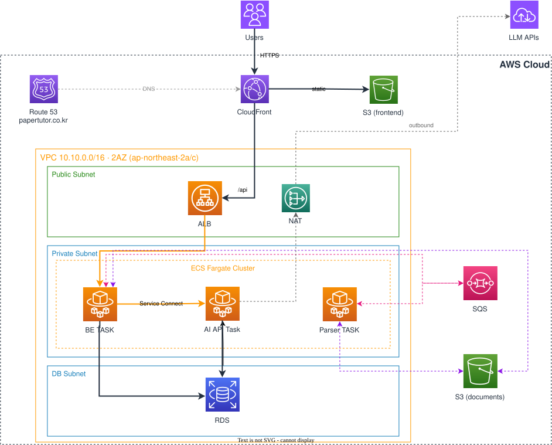

# PaperTutor AWS Infrastructure

## 1. 문서 목적

이 문서는 팀 내에 서비스의 AWS 구성, 서비스 간 통신 경로와 주요 설계 의도를 공유하기 위한
온보딩 문서다.

## 2. 설계 목표

AWS 리소스는 단일 리전에 구성하고 DEV와 PROD 환경으로 분리한다. 운영 변경을 실제 사용자 환경에
반영하기 전에 PROD와 동일한 구조에서 검증할 수 있도록 DEV(Staging)를 별도로 운영한다.

소규모 팀 구조상 인프라 관리 인력이 없기에 호스트와 클러스터 운영보다 **애플리케이션에 집중**한다.
그리고 Backend, AI와 Parser를 독립적으로 배포·복구·운영할 수 있도록 한다.
- Host 운영: EC2 인스턴스 생성, OS 패치, 보안 업데이트, 장애 교체
- Cluster 운영: 컨테이너를 실행할 서버 용량 확보, 노드 추가·제거, 배치와 확장 관리

## 3. 현재 아키텍처

위 다이어그램은 현재 DEV 환경을 기준으로 한다. 호스트와 클러스터 운영 부담을 줄이기 위해
Amazon ECS on AWS Fargate, Amazon RDS, Amazon SQS, Amazon S3 등 AWS 관리형 서비스를 중심으로 구성했다.

## 4. 컴포넌트별 책임

각 컴포넌트의 책임은 다음과 같다.

| 영역 | 컴포넌트 | 책임 |
|---|---|---|
| DNS·TLS | Route 53, ACM | FE·API 도메인 연결과 TLS 인증서 검증 |
| FE 전달 | CloudFront, Private S3 | React 빌드 결과 제공, SPA 경로 처리, `/api/*`를 ALB로 전달 |
| 외부 API 진입 | Public ALB | CloudFront origin-facing 대역에서 온 HTTPS 요청만 받아 Backend target group으로 전달하고 health check 수행 |
| 외부 통신 | NAT Gateway | Private subnet의 ECS Task가 외부 API·SSM·이미지 저장소로 나가는 경로 |
| BE API | Backend ECS Service | 인증·권한·제품 데이터, presigned URL 발급, AI 호출 중계, 파싱 요청·결과 처리 |
| AI API  | AI API ECS Service | Backend의 내부 HTTP·SSE 요청을 받아 AI 응답 생성 |
| Parser Worker | Parser Worker ECS Service | SQS 파싱 요청을 long polling하고 논문 파싱 결과를 발행 |
| 관계형 데이터 | RDS PostgreSQL | 사용자·문서·대화 등 데이터, LangGraph의 checkpoint |
| 파일 데이터 | Application S3 | PDF 원본, 처리 결과와 DLQ 원본 archive 보관 |
| 비동기 처리 | SQS | `parse-requests`, `parse-results`와 각 DLQ 제공 |
| 최종 실패 처리 | DLQ Handler Lambda | DLQ 원본을 S3에 보관하고 요청 재시도 소진을 실패 결과로 변환 |
| Secret | Secrets Manager | DB 비밀번호와 Backend·AI runtime secret 보관 및 ECS 주입 |
| Image | ECR | Backend와 AI 컨테이너 image 보관 |
| 관측 | CloudWatch | 로그, 주요 metric과 alarm 제공 |
| DEV 운영시간 | EventBridge Scheduler | DEV RDS와 ECS Service를 정해진 시간에 시작·정지 |

## 5. 핵심 통신/요청 경로

- 웹·API: 사용자는 CloudFront로 진입한다. 정적 파일은 비공개 FE S3에서 제공하고, `/api/*` 요청은
  ALB를 거쳐 Backend로 전달한다.
- 채팅: Backend가 Service Connect를 통해 AI API를 호출하고, AI 응답을 FE에 SSE로 중계한다.
- 문서 파싱: FE는 presigned URL로 PDF를 Application S3에 직접 업로드한다. Backend와 Parser Worker는
  SQS를 통해 파싱 요청과 결과를 주고받는다.
- DB 접근: RDS는 DEV·PROD 모두 Private subnet에 둔다. 접속이 필요한 경우, 일회성 Fargate relay Task를 띄우고 
  SSM 포트포워딩으로 로컬 포트를 RDS에 연결한다. 절차는 infra의
  [`rds-dbeaver` runbook](https://github.com/team-ymc/infra/blob/main/docs/runbooks/rds-dbeaver.md)을 따른다.

각 경로의 API·메시지 형식은 [`contracts`](../contracts/README.md), 설계 선택의 근거는
[`decisions`](../decisions/README.md)에서 관리한다.

## 6. 배포 구조

Terraform은 AWS 리소스와 초기 Task Definition을 구성하고, 이후 애플리케이션 배포는 각 저장소의
GitHub Actions가 담당한다.

환경별 배포 흐름과 rollback 전략은 [`CI/CD`](ci-cd.md)에서 관리한다.
