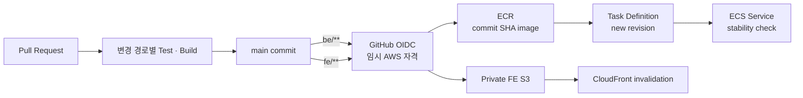

# PaperTutor CI/CD

## 1. 문서 목적

이 문서는 PaperTutor의 지속적 통합, 애플리케이션 배포와 rollback 구조를 설명한다.

## 2. 배포 흐름

Terraform은 AWS 리소스와 초기 Task Definition을 구성하고, 이후 활성 애플리케이션 revision은
각 저장소의 GitHub Actions가 배포한다.

| 대상 | 검증과 배포 | 배포 결과 |
|---|---|---|
| FE | PR에서 type check, test, build를 수행한다. `main`의 `fe/**` 변경 시 다시 build한다. | S3를 build 결과와 동기화한 뒤 CloudFront cache를 무효화한다. |
| Backend | PR에서 test와 container build를 수행한다. `main`의 `be/**` 변경 시 test를 다시 실행한다. | commit SHA로 image를 ECR에 저장하고 새 Task Definition revision을 ECS Service에 배포한다. |
| AI API·Parser Worker | PR에서 test와 build를 수행한다. `ai` 저장소 `main` push 시 image를 build한다. | commit SHA image를 ECR에 저장하고 AI API·Parser Worker 두 ECS Service에 새 revision을 배포한다(dev). |
| Terraform | 변경 사항의 plan을 검토한 뒤 환경 root module을 적용한다. | AWS 리소스와 애플리케이션이 사용하는 배포 기반을 구성한다. |

FE와 Backend 배포는 동시에 하나만 실행한다. 진행 중인 배포를 취소하지 않고 다음 배포가 완료될
때까지 대기시켜 같은 대상에 대한 변경이 겹치지 않게 한다.

## 3. 배포 자격과 권한

GitHub Actions는 GitHub OIDC Role을 통해 배포 시점에 임시 자격을 발급받으며, `app` 저장소의 `main` branch workflow만 Role을 사용할 수 있다.

배포 Role은 Backend ECR push와 ECS 배포, FE S3 동기화와 CloudFront invalidation에 필요한 권한만
가진다.

## 4. Rollback

| 대상 | 방법 | 제약 |
|---|---|---|
| FE | 지정한 이전 commit을 checkout하고 다시 build해 S3에 배포한다. | 과거 artifact를 보관하지 않으므로 최초 배포와 bit 단위로 같은 결과를 보장하지 않는다. |
| Backend | 지정한 기존 Task Definition revision으로 ECS Service를 변경하고 안정화를 기다린다. | 기능 오류는 사람이 rollback 대상을 선택한다. 기동 실패는 ECS deployment circuit breaker가 처리한다. |
| AI API·Parser Worker | 전용 rollback workflow를 별도로 정의한다. | 자동화 전에는 배포 대상 revision과 복구 절차를 함께 검증해야 한다. |
| Terraform | 변경 유형에 맞춰 이전 구성으로 수정하고 plan을 검토한 뒤 적용한다. | 상태를 임의로 되돌리지 않으며 데이터 변경이 포함되면 별도 복구 절차가 필요하다. |

