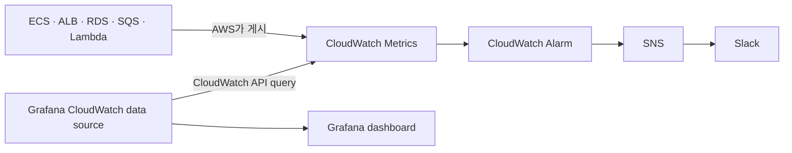
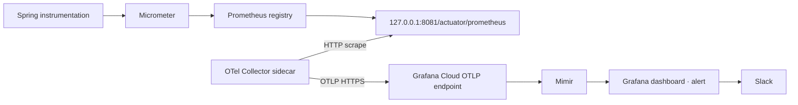
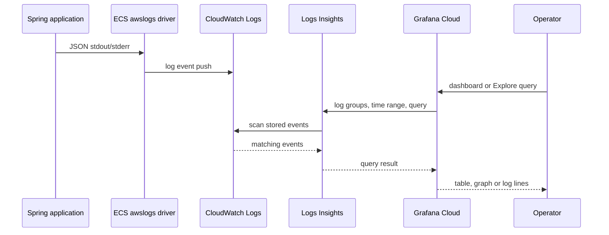

# Telemetry Pipelines

metric과 로그가 생성되어 수집·전송·저장·조회되는 책임의 SSOT다.

- Decision: [ADR-007](../../decisions/ADR-007-observability-platform.md) (`Accepted`)

## Terminology

| 용어 | 의미 |
|---|---|
| OpenTelemetry (`OTel`) | metric·로그·trace를 같은 모델로 계측하고 처리하기 위한 공개 표준과 도구 모음 |
| OpenTelemetry Protocol (`OTLP`) | OTel 데이터를 Collector에서 저장소로 전송할 때 사용하는 통신 규격 |
| Prometheus exposition | 애플리케이션이 metric을 HTTP endpoint에서 제공하는 형식 |
| PromQL | Mimir나 Prometheus 호환 metric 저장소에 보관된 metric을 조회하는 언어 |

## 1. Component Responsibilities

| 구성요소 | 책임 | 저장소 여부 |
|---|---|---|
| Micrometer | Spring의 JVM·process·HTTP·DB pool·custom metric 기록 | 애플리케이션 메모리에 단기 보유 |
| Prometheus registry | Micrometer meter를 Prometheus exposition 형식으로 표현 | 아니오 |
| Spring Actuator | `/actuator/prometheus` HTTP endpoint 제공 | 아니오 |
| OTel Collector | endpoint scrape, 형식 변환, 공통 attribute 부여, batch·retry와 export | 아니오 |
| CloudWatch Metrics | AWS 관리형 리소스 metric 보관과 alarm 평가 | 예 |
| CloudWatch Logs | ECS stdout/stderr 로그 보관 | 예 |
| CloudWatch Logs Insights | CloudWatch Logs query 실행 | 아니오 |
| Grafana Cloud Mimir | 애플리케이션 metric 보관과 PromQL query | 예 |
| Grafana CloudWatch data source | CloudWatch API를 호출해 metric·로그 query 결과 조회 | 아니오 |
| Grafana | dashboard, Explore, query와 application alert 평가 | telemetry 원본 저장소가 아님 |
| SNS | CloudWatch Alarm notification fan-out | 아니오 |
| Slack | 운영 알림의 최종 전달과 협업 | telemetry 저장소가 아님 |

## 2. AWS Infrastructure Metrics



- AWS가 기본적으로 만들어주는 인프라 metric으로 아래 등을 포함한다.
	- ECS CPU·메모리 사용률
	- ALB 요청 수·응답시간·5xx
	- RDS CPU·연결 수·스토리지
	- ECS Task 수 등
- AWS가 관리형 리소스 metric을 CloudWatch에 게시하고, CloudWatch가 metric 원본을 보관한다.
- Grafana data source는 dashboard query 시 CloudWatch API를 호출한다. 조회한 metric 원본을 Mimir에 복제하지 않는다.
- 기존 CloudWatch Alarm이 threshold를 평가하고 SNS를 통해 Slack으로 전달한다.

## 3. Spring Application Metrics(Sidecar 경로)



1. Spring 내부에서 발생하는 애플리케이션 메트릭이다.
	- API 요청 수
	- 응답시간
	- JVM heap·GC·thread
	- HTTP 5xx
	- 커스텀 (SSE 연결 수, TTFT)
2. Spring 애플리케이션의 metric은 Micrometer의 metric 저장소(`MeterRegistry`)에 기록된다.
3. `micrometer-registry-prometheus`는 Micrometer metric을 Prometheus exposition 형식으로 표현한다.
4. Actuator management server를 8081에 두고 `/actuator/prometheus` endpoint를 활성화하면 해당 형식의 metric을 제공한다.
5. Backend ECS Task에 sidecar로 배치한 OTel Collector가 endpoint를 주기적으로 scrape한다.
6. Collector는 수집한 metric을 OpenTelemetry의 공통 metric 형식으로 변환한다.
7. Collector는 metric을 Grafana Cloud에 전송한다.
8. Grafana Cloud는 metric을 Mimir에 보관하고 Grafana는 이를 PromQL로 조회한다.

### Metric Routing Boundary

애플리케이션이 직접 정의했다는 의미의 custom metric과 AWS 제품인 CloudWatch Classic Custom Metrics를 구분한다. Spring이 Micrometer에 기록하는 custom metric의 기본 저장소는 Mimir이며, custom metric이라는 이유만으로 CloudWatch Classic 경로를 사용하지 않는다.

예를 들어 현재 SSE 연결 수, SSE 연결 지속시간, AI 응답의 첫 delta 도착시간과 제품 기능별 처리 결과는 Micrometer에 기록해 위의 Mimir pipeline으로 보낸다. AWS가 기본 제공하는 ALB active connection, ECS CPU·memory 같은 인프라 metric은 이 값을 대신하지 않는다.

CloudWatch Classic Custom Metrics와 CloudWatch OTel Metrics는 기본 애플리케이션 metric pipeline에 포함하지 않는다. 다만 AWS Application Auto Scaling, CloudWatch Alarm의 AWS 자동 대응처럼 AWS control plane이 직접 읽어야 하는 metric은 필요한 집계값만 CloudWatch에 별도로 게시할 수 있다. 이 예외는 metric별 목적, 중복 저장 비용과 판정 주체를 명시한 뒤 추가한다.

Mimir 사용량은 metric 이름과 전체 label 값 조합으로 생성되는 active series 및 scrape 주기에 따른 DPM으로 관리한다. 초기 전역 scrape 주기는 60초로 두고 더 높은 해상도가 필요한 job만 근거를 남겨 조정한다. `user_id`, `paper_id`, `request_id`, `trace_id`, SSE connection ID와 실제 식별자가 포함된 URL은 metric label로 사용하지 않는다.

### Collector Deployment

Spring Backend의 Fargate Task마다 OTel Collector를 sidecar로 둔다. 애플리케이션 API는 8080, Actuator management server는 8081을 사용한다. management server는 loopback에 bind하고 Collector는 같은 Task의 `127.0.0.1:8081/actuator/prometheus`만 scrape한다. `/actuator/prometheus`는 public ALB에 노출하지 않는다.

ALB readiness 확인은 management port가 아니라 애플리케이션 port 8080의 `/readyz`를 사용한다. 따라서 management context만 정상이고 실제 애플리케이션 HTTP server가 응답하지 못하는 상태를 healthy로 판단하지 않는다.

ECS container health check는 애플리케이션 port 8080의 `/livez`를 사용한다. liveness 실패는 Task 교체 대상으로 판단하고, readiness 실패는 ALB가 해당 Task로의 트래픽만 중단하는 데 사용한다.

FastAPI와 Parser도 ECS에서 운영되는 동안 각 Task에 Collector sidecar를 둔다. metric 계측과 노출 endpoint는 Backend pipeline 검증 후 해당 서비스 담당자가 정한다.

각 Collector는 Task를 구분할 수 있는 고유한 `service.instance.id`를 metric에 부여한다. Collector 장애나 자원 사용이 Spring의 요청 성공 여부를 결정해서는 안 된다.

sidecar 선택 근거와 중앙 Collector service 재검토 조건은 [ADR-007](../../decisions/ADR-007-observability-platform.md)에서 관리한다.

## 4. ECS Application Logs



- 애플리케이션은 JSON 한 줄을 stdout/stderr에 기록한다.
- ECS `awslogs` log driver가 log event를 CloudWatch Logs에 push한다.
- CloudWatch Logs가 원본을 보관하고 Logs Insights가 query를 실행한다.
- Grafana CloudWatch data source가 필요할 때 AWS API로 query를 실행하고 결과만 표시한다.
- Grafana dashboard 정의, query와 alert state는 Grafana에 존재하지만 CloudWatch 로그 원본은 Loki에 복제되지 않는다.
- dashboard refresh와 Grafana alert evaluation은 CloudWatch query를 반복할 수 있으므로 시간 범위, log group, evaluation interval과 refresh 주기를 제한한다.
- Grafana transformation은 반환된 결과의 표시만 바꾸며 CloudWatch의 원본이나 이미 수행된 scan 양을 줄이지 않는다.

### Required JSON Fields

| 필드 | 용도 | 규칙 |
|---|---|---|
| `timestamp` | 발생 시각 | UTC, ISO 8601 |
| `level` | 로그 수준 | `DEBUG`, `INFO`, `WARN`, `ERROR` |
| `deployment.environment.name` | 환경 구분 | dev는 `development`, prod는 `production` |
| `service.name` | 서비스 구분 | 낮은 cardinality의 고정 이름 |
| `service.version` | 배포 회귀 분석 | image 또는 release 식별자 |
| `message` | 사람이 읽는 요약 | 본문·secret·token 제외 |
| `error.code` | 안정적인 오류 분류 | 정의된 코드만 사용 |
| `request.id` | 요청 상관 분석 | 로그·trace 전용, metric label 금지 |
| `trace_id`, `span_id` | trace 상관 분석 | 분산 추적 도입 후 사용 |

PDF 본문, 사용자 질문, AI 답변, access·refresh token, cookie, authorization header, password와 presigned URL은 기록하지 않는다. `paper_id`와 `user_id`는 디버깅 필요성과 개인정보 정책을 별도로 확정한 뒤 허용한다.

## 5. Environment Model

dev와 prod는 pipeline 정의를 공유한다.

| 항목 | 공통 | 환경별 허용 차이 |
|---|---|---|
| metric·로그 schema | 예 | 없음 |
| collector config 구조 | 예 | endpoint secret, resource attribute |
| Grafana Cloud stack | 예 | 없음 |
| Mimir 전송 token | 발급 방식과 권한 | 환경별 token |
| CloudWatch 연결 | data source와 read role 구조 | 환경별 data source와 read role |
| dashboard | 예 | dashboard variable의 environment 값 |
| alert rule 구조 | 예 | threshold, evaluation window, severity |
| Slack 전달 | 같은 integration 방식 | destination channel과 호출 강도 |
| retention·sampling | 기본 정책 공유 | 비용·보안 요구가 있을 때 명시적 override |

필수 resource attribute:

```text
deployment.environment.name = development | production
service.namespace           = paper-teacher
service.name                = backend | ai-api | parser-worker
service.version             = release identifier
```

`service.instance.id`는 replica 구분에 사용하되 dashboard의 상시 group-by 기준으로 남용하지 않는다.

## 6. Alert Delivery

```text
AWS infrastructure alert: CloudWatch Alarm → SNS → Slack
Application metric alert: Mimir → Grafana Alerting → Slack
CloudWatch log alert:      Logs Insights query → Grafana Alerting → Slack
```

- AWS 리소스 가용성과 saturation은 CloudWatch Alarm이 판정한다.
- 애플리케이션 rate, error와 duration은 Grafana가 Mimir metric으로 판정한다.
- 로그 기반 alert는 metric으로 표현할 수 없는 치명적인 pattern에 한정한다. 짧은 주기의 반복 query는 비용과 alert noise를 함께 증가시킨다.
- 동일 장애를 CloudWatch와 Grafana가 중복 통지하지 않도록 각 signal의 판정 주체를 하나로 정한다.
- threshold와 notification 정책은 pipeline 검증 후 실제 baseline을 수집해 결정한다.

## 7. Open Questions

1. FastAPI와 Parser의 metric 계측 및 노출 방식
2. CloudWatch 로그의 retention과 Grafana query budget
3. Slack channel, severity, cooldown과 on-call 정책
4. Loki, distributed tracing과 error tracking 도입 시점
