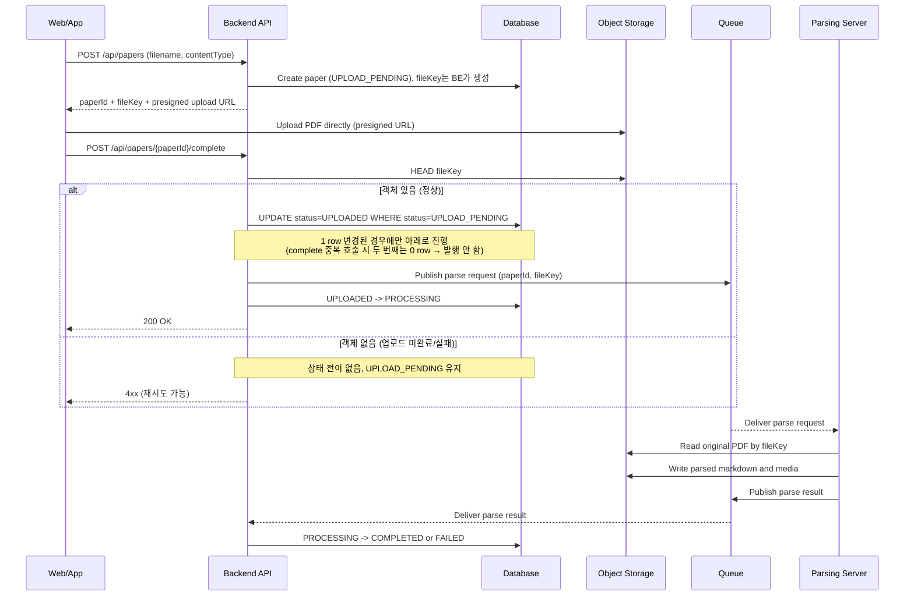
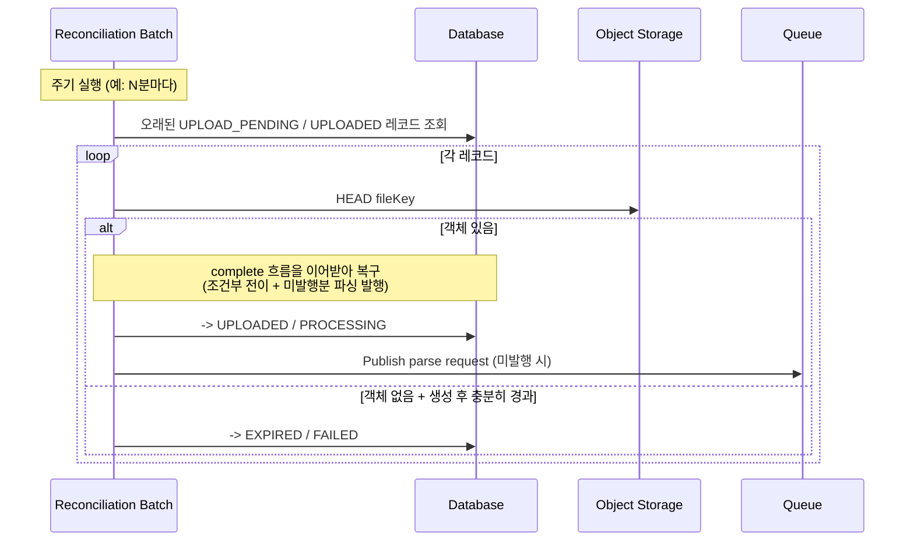

# ADR-001: PDF 업로드는 presigned URL 기반 FE -> S3 직접 업로드로 한다

## 1. Overview

- Date: 2026-07-03
- Status: Proposed (팀 합의 전)
- Deciders: 근흐흐
- Tracking: FT-003 논문 등록 · 분석

## 2. Context

- 사용자는 웹/앱에서 PDF를 업로드해 문서를 등록한다.
- PDF는 크기가 커질 수 있다.(100페이지 이상, 이미지 포함 문서도 처리 대상)
- 업로드는 동시에 여러 건 발생할 수 있고, 파일 크기·동시성을 사전에 안정적으로 예측하기 어렵다. BE의 네트워크 대역폭·메모리·처리 시간은 유한한 제약이다.
- 파싱 파이프라인은 S3에 저장된 원본 파일의 key를 입력으로 받아 비동기 처리한다. 파일 원본은 S3에 저장되고, 서비스 간 메시지에는 참조 key가 전달된다.

## 3. Decision

PDF 원본은 S3 호환 object storage에 저장한다. BE는 파일 메타데이터 row를 생성하고 presigned upload URL을 발급한다. FE는 발급받은 URL로 S3에 PDF를 직접 업로드한다.

MVP에서는 FE가 업로드 완료 후 BE의 complete API를 호출하는 방식을 primary 완료 신호로 사용한다. BE는 complete 요청을 받으면 S3 HEAD로 객체 존재 여부와 메타데이터를 확인한 뒤 파일 상태를 전이              하고, 파싱 요청 메시지에 `paperId`와 `fileKey`를 담아 발행한다.

FE의 PDF 확장자/크기 검사는 사용자 경험을 위한 사전 검증으로만 사용한다. 신뢰 가능한 검증은 BE 또는 Worker에서 업로드 후 다시 수행한다.

## 4. Options Considered

### Option A. presigned URL 직접 업로드 ✅ 채택

- 장점: 파일 바이트가 BE를 거치지 않아 업로드 트래픽과 API 서버 스케일을 분리할 수 있다.
- 장점: S3 key를 기준으로 동작하는 비동기 파싱 파이프라인과 자연스럽게 연결된다.
- 장점: 클라이언트에 장기 자격증명을 노출하지 않고 짧은 만료 시간의 업로드 권한만 위임할 수 있다.
- 단점: S3 CORS, presigned URL 만료, 업로드 완료 확인, 실패 업로드 정리 정책이 필요하다.

### Option B. BE 프록시 업로드

- 장점: FE 입장에서는 단일 API 업로드로 단순하다.
- 장점: BE가 업로드 스트림을 직접 보므로 매직바이트, PDF 파싱 가능 여부 등의 검증을 업로드 시점에 수행하기 쉽다.
- 단점: 대형 PDF와 동시 업로드가 늘어날수록 BE가 파일 전송 병목이 된다.
- 단점: 업로드 트래픽 증가에 대응하려면 BE 인스턴스 증설이 필요하고, 일반 API 트래픽과 파일 업로드 트래픽이 같은 스케일 단위에 묶인다.
- 탈락 사유: 파일 크기와 동시성을 안정적으로 예측하기 어렵고, 파싱 파이프라인이 이미 S3 key 기반으로 분리되어 있으므로 BE가 파일 바이트를 중계할 이유가 약하다.

## 5. Consequences

### Trade-offs

- BE는 대용량 파일 바이트 처리에서 벗어나 업로드 권한 발급 · 메타데이터 · 상태 전이 · 이벤트 발행에 집중할 수 있다. 그 대가로, 업로드 완료가 단일 API 요청으로 원자적으로 보장되지 않으므로 complete API, S3 HEAD 확인 등을 구현해야 한다.
- 파싱 서버는 메시지의 `fileKey`만으로 자체 권한을 사용해 S3에서 원본 PDF를 읽을 수 있어, 서비스 간에 파일 바이트를 주고받지 않는다.
- 업로드(S3)와 완료 통보(complete API)가 분리된 두 동작이므로 그 사이에 틈이 생긴다. FE가 S3 업로드를 성공한 뒤 complete를 호출하기 전에 종료되면(탭 닫힘 · 네트워크 단절 등), 파일은 S3에 존재하지만 레코드는 `UPLOAD_PENDING`에 멈춰 파싱이 시작되지 않는다. 별도 복구 장치가 없으면 이 레코드는 지연이 아니라 영구히 방치된다. 이를 아래 reconciliation batch로 보완한다.

### Follow-ups

**필수**

- **Reconciliation batch** 주기적으로 도는 백그라운드 잡이 오래 멈춘 레코드를 S3 실제 상태와 대조해 바로잡는다. 생성된 지 오래된 `UPLOAD_PENDING` 레코드를 S3 HEAD로 확인해, 객체가 있으면 완료 처리를 이어받아 복구하고(FE가 complete 전에 종료된 경우), 없으면 만료/실패로 정리한다. 확인 범위는 `UPLOAD_PENDING`뿐 아니라 `UPLOADED`까지 포함한다 — complete는 받았지만 큐 발행이 실패해 `UPLOADED`에 멈춘 레코드도 같은 방식으로 복구해야 하기 때문이다.

**옵션 (지금 구현하지 않음, 필요 시 별도 결정)**

- 브라우저 종료 후에도 즉시 처리가 필요하다는 요구가 발생하면, complete API에 더해 S3 ObjectCreated event 기반 완료 감지를 이중 신호로 검토한다. MVP에서는 complete API로 충분하다.
- 메시지 큐 구현체 선정(SQS 등) — Data Flow의 `Queue`는 추상 표현이며, 구체 큐 도입은 별도 결정으로 다룬다.

## 6. Data Flow

### 정상 흐름 + complete 실패 분기

### Reconciliation batch (멈춘 레코드 복구)

FE가 complete를 호출하기 전에 종료되면 위 흐름이 중간에 끊겨 레코드가 멈춘다. 주기적으로 도는 batch가 이를 S3 실제 상태와 대조해 복구한다.

## 7. Updates

- 없음
