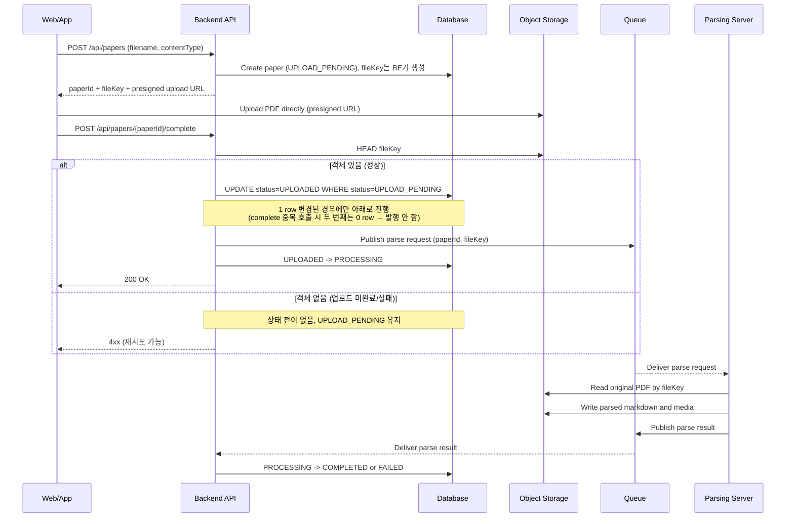
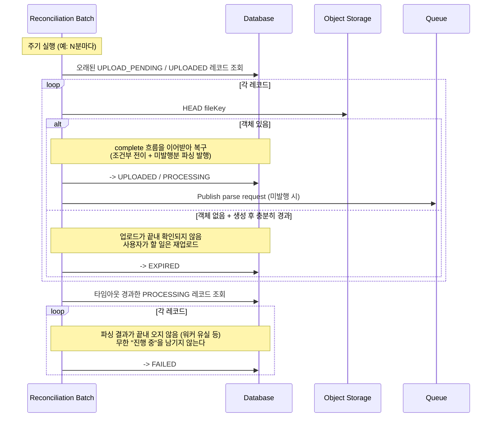

# ADR-001: PDF 업로드는 presigned URL 기반 FE -> S3 직접 업로드로 한다

## 1. Overview

- Date: 2026-07-03 (Accepted: 2026-07-11)
- Status: Accepted
- Deciders: 근흐흐
- Tracking: FT-003 논문 등록 · 분석 / YMC-179
- Implements: `contracts/frontend-backend/openapi.yaml` / `contracts/backend-ai/openapi.yml`

## 2. Context

- 사용자는 웹/앱에서 PDF를 업로드해 문서를 등록한다.
- PDF는 크기가 커질 수 있다.(100페이지 이상, 이미지 포함 문서도 처리 대상)
- 업로드는 동시에 여러 건 발생할 수 있고, 파일 크기·동시성을 사전에 안정적으로 예측하기 어렵다. BE의 네트워크 대역폭·메모리·처리 시간은 유한한 제약이다.
- 파싱 파이프라인은 S3에 저장된 원본 파일의 key를 입력으로 받아 비동기 처리한다. 파일 원본은 S3에 저장되고, 서비스 간 메시지에는 참조 key가 전달된다.

## 3. Decision

PDF 원본은 S3 호환 object storage에 저장한다. BE는 파일 메타데이터 row를 생성하고 presigned upload URL을 발급한다. FE는 발급받은 URL로 S3에 PDF를 직접 업로드한다.

MVP에서는 FE가 업로드 완료 후 BE의 complete API를 호출하는 방식을 primary 완료 신호로 사용한다. BE는 complete 요청을 받으면 S3 HEAD로 객체 존재 여부와 메타데이터를 확인한 뒤 파일 상태를 전이              하고, 파싱 요청 메시지에 `paperId`와 `fileKey`를 담아 발행한다.

FE의 PDF 확장자/크기 검사는 사용자 경험을 위한 사전 검증으로만 사용한다. 신뢰 가능한 검증은 BE 또는 Worker에서 업로드 후 다시 수행한다.

## 4. Options Considered

### Option A. presigned URL 직접 업로드 ✅ 채택

- 장점: 파일 바이트가 BE를 거치지 않아 업로드 트래픽과 API 서버 스케일을 분리할 수 있다.
- 장점: S3 key를 기준으로 동작하는 비동기 파싱 파이프라인과 자연스럽게 연결된다.
- 장점: 클라이언트에 장기 자격증명을 노출하지 않고 짧은 만료 시간의 업로드 권한만 위임할 수 있다.
- 단점: S3 CORS, presigned URL 만료, 업로드 완료 확인, 실패 업로드 정리 정책이 필요하다.

### Option B. BE 프록시 업로드

- 장점: FE 입장에서는 단일 API 업로드로 단순하다.
- 장점: BE가 업로드 스트림을 직접 보므로 매직바이트, PDF 파싱 가능 여부 등의 검증을 업로드 시점에 수행하기 쉽다.
- 단점: 대형 PDF와 동시 업로드가 늘어날수록 BE가 파일 전송 병목이 된다.
- 단점: 업로드 트래픽 증가에 대응하려면 BE 인스턴스 증설이 필요하고, 일반 API 트래픽과 파일 업로드 트래픽이 같은 스케일 단위에 묶인다.
- 탈락 사유: 파일 크기와 동시성을 안정적으로 예측하기 어렵고, 파싱 파이프라인이 이미 S3 key 기반으로 분리되어 있으므로 BE가 파일 바이트를 중계할 이유가 약하다.

## 5. Consequences

### Trade-offs

- BE는 대용량 파일 바이트 처리에서 벗어나 업로드 권한 발급 · 메타데이터 · 상태 전이 · 이벤트 발행에 집중할 수 있다. 그 대가로, 업로드 완료가 단일 API 요청으로 원자적으로 보장되지 않으므로 complete API, S3 HEAD 확인 등을 구현해야 한다.
- 파싱 서버는 메시지의 `fileKey`만으로 자체 권한을 사용해 S3에서 원본 PDF를 읽을 수 있어, 서비스 간에 파일 바이트를 주고받지 않는다.
- 업로드(S3)와 완료 통보(complete API)가 분리된 두 동작이므로 그 사이에 틈이 생긴다. FE가 S3 업로드를 성공한 뒤 complete를 호출하기 전에 종료되면(탭 닫힘 · 네트워크 단절 등), 파일은 S3에 존재하지만 레코드는 `UPLOAD_PENDING`에 멈춰 파싱이 시작되지 않는다. 별도 복구 장치가 없으면 이 레코드는 지연이 아니라 영구히 방치된다.
- 파싱이 비동기이므로 결과가 끝내 오지 않을 수도 있다(워커 유실 · 메시지 소실). 레코드는 `PROCESSING`에 영구 정체하고, 사용자에게는 "영원히 진행 중"으로 보인다 — 무엇을 해야 할지 알 수 없으니 실패보다 나쁘다.
- **위 두 정체는 아래 reconciliation batch로만 해소되는데, 그 batch는 post-MVP다. 즉 MVP는 이 갭을 안고 간다.** presigned 직접 업로드를 택한 대가이며, Option B(BE 프록시)였다면 업로드 완료가 단일 요청으로 원자적이라 이 문제가 없었다.

### Follow-ups

**필수 — 단, MVP에서는 구현하지 않는다 (post-MVP)**

> **MVP는 정체를 방치한다.** 아래 batch가 없으므로 멈춘 레코드는 그대로 남고, 서재에는 "진행 중"으로 계속 표시된다. `EXPIRED`는 이 batch만이 쓰는 값이라 **MVP에서는 발생하지 않는다.** 이 갭을 알고 넘어가는 것이며, 해소는 post-MVP다.

- **Reconciliation batch** 주기적으로 도는 잡이 멈춘 레코드를 실제 상태와 대조해 바로잡는다. **어떤 상태도 영구 정체하지 않는다**는 것이 목적이다.
  - `UPLOAD_PENDING` 정체 — S3에 객체가 있으면 complete 흐름을 이어받아 복구(FE가 complete 전에 종료된 경우), 충분히 경과했는데도 없으면 `EXPIRED`. 사용자가 할 일은 재업로드다.
  - `UPLOADED` 정체 — 큐 발행이 실패해 멈춘 경우. 재발행해 `PROCESSING`으로 복구한다.
  - `PROCESSING` 정체 — 파싱 결과 미도착. 타임아웃 시 `FAILED`. (파일은 올라갔고 파싱만 끝나지 못했으므로 파싱 실패와 같은 부류다 — `EXPIRED`는 업로드 미확인을 뜻하므로 쓰지 않는다.)

**옵션 (지금 구현하지 않음, 필요 시 별도 결정)**

- 브라우저 종료 후에도 즉시 처리가 필요하다는 요구가 발생하면, complete API에 더해 S3 ObjectCreated event 기반 완료 감지를 이중 신호로 검토한다. MVP에서는 complete API로 충분하다.

> Data Flow의 `Queue`는 **SQS**다 (로컬은 LocalStack). 큐 이름과 전달 의미론은 ADR-002가,
> BE↔AI HTTP API와 그 request/response schema는 `contracts/backend-ai/openapi.yml`이 소유한다.

## 6. Data Flow

### 정상 흐름 + complete 실패 분기

### Reconciliation batch (멈춘 레코드 복구)

흐름이 중간에 끊기면 레코드가 멈춘다 — FE가 complete 전에 종료되거나, 큐 발행이 실패하거나, 파싱 결과가 끝내 오지 않는 경우다. 주기적으로 도는 batch가 이를 실제 상태와 대조해 복구하거나 종결 상태로 내린다. **정체된 채로 남는 레코드는 없다.**

## 7. Updates

- **2026-07-11** — Status를 `Proposed` → `Accepted`로 확정. 이 ADR을 전제로 현재의 `contracts/frontend-backend/openapi.yaml`이 0.1.0으로 고정되었고, BE 구현(YMC-182)이 착수되었다. 상태 enum(`UPLOAD_PENDING → UPLOADED → PROCESSING → COMPLETED | FAILED | EXPIRED`)과 조건부 전이(complete 중복 호출 방어), reconciliation batch가 모두 계약과 feature 문서에 반영되었다.
- **2026-07-12** — batch 스캔 범위에 `PROCESSING`을 추가하고 타임아웃 시 `FAILED`로 전이하도록 §5·§6을 고쳤다. 기존 batch는 `UPLOAD_PENDING`/`UPLOADED`만 봐서, 파싱 워커가 죽으면 "영원히 진행 중"으로 남는 구멍이 있었다.
- **2026-07-12** — **reconciliation batch를 post-MVP로 결정했다.** MVP는 정체를 방치한다 — 멈춘 레코드는 서재에 "진행 중"으로 계속 남고, `EXPIRED`는 발생하지 않는다. batch를 구현할 Story도 티켓도 없는 상태에서 MVP 인수조건으로만 걸려 있었기에, 스코프를 정직하게 내렸다. §5 Consequences·Follow-ups에 갭을 명시했다.
- **2026-07-12** — 당시 BE↔AI 비동기 계약을 별도 AsyncAPI와 JSON Schema 파일로 만들었다. envelope만 확정하고 파싱 산출물 본문은 AI 소유로 비워 뒀다.
- **2026-07-22** — 임시 AsyncAPI·외부 JSON Schema 파일을 제거했다. 현재 BE↔AI HTTP API와 그 request/response schema의 SSOT는 `contracts/backend-ai/openapi.yml`이며, SQS 토폴로지와 전달 의미론은 ADR-002가 유지한다.
