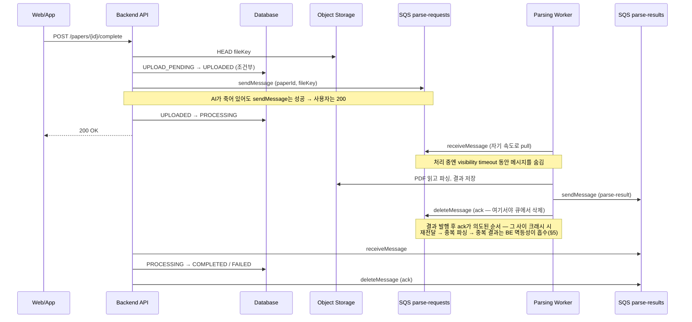
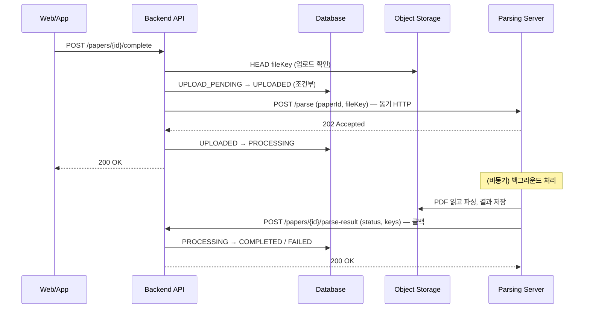
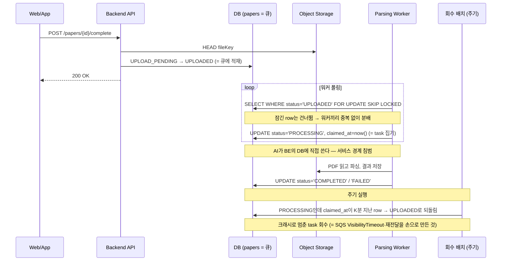

# ADR-002: BE ↔ AI 비동기 배선은 SQS로 한다

## 1. Overview

- Date: 2026-07-15
- Status: Accepted
- Deciders: 근흐흐
- Tracking: FT-003 논문 등록 · 분석 (Story 3·5) / YMC-182
- Implements: SQS 채널 토폴로지와 전달 의미론은 이 ADR이 소유한다. BE↔AI HTTP API와 그 request/response schema는 `contracts/backend-ai/openapi.yml`을 따른다.
- Related: ADR-001 (PDF 업로드 presigned URL)

## 2. Context

### 팀과 서비스 구조

- **2인 팀** : 한 명이 AI 및 파싱 서버, 한 명이 BE를 맡는다. FE와 인프라는 두 사람이 겸업한다. **인프라를 상시 책임질 인력이 없다.**
- 두 서비스는 **다른 언어 · 다른 repo · 다른 소유자**다. 둘 사이의 유일한 접점은 `project-docs/contracts/`의 계약이며, 이는 워크스페이스 규칙으로 강제된다.
- 배포 타깃은 AWS다. S3는 ADR-001에서 이미 채택했고, AWS 비용은 크레딧으로 지원된다.

### 처리 특성

- 파싱은 **분 단위**로 걸린다. 사용자는 업로드 직후 결과를 받지 못하고, 서재에서 "분석 중" 상태를 본다(FT-003).
- 파싱 서버는 배포·재시작 등으로 **부재 구간**을 갖는다. 그 사이에 들어온 요청이 유실되면 레코드는 `PROCESSING`에 정체된다.
- BE는 `PaperStatus`의 단일 writer다. AI/파싱 서버는 결과만 발행하고 상태를 직접 쓰지 않는다(ADR-001).

### 실 부하

**MVP 기준 실 부하는 하루 수십~수백 건이며, 동시 파싱은 몇 건 수준이다.**

이 규모는 **큐 없이도 처리된다.** HTTP 직접 호출로도, DB 테이블 폴링으로도 충분하다. 따라서 "대용량 비동기 처리를 위해 큐를 도입했다"는 서술은 이 프로젝트에서 **성립하지 않으며, 이 ADR은 그런 근거를 쓰지 않는다.** 선택을 가르는 축은 **실패 모드와 서비스 경계**다.

실 부하와 별개로, 이 프로젝트는 **피크 시간대에 요청이 몰리는(스파이크) 환경과 안정성을 가정하고 설계하는 것**을 학습 목표로 삼는다.

## 3. Decision

**BE ↔ AI 비동기 배선은 AWS SQS 표준 큐 2개로 한다.** `parse-requests`(BE → AI), `parse-results`(AI → BE).

**이 결정의 근거는 발행 이후 구간의 요청 유실 제거와 운영부담 최소화이다.**
- 두 서비스는 언제든 죽을 수 있다(배포 · 재시작 · 크래시). 그 사이에 오간 요청이 사라지면 안 된다.
- BE가 AI에 작업을 넘길 때 요청을 잃지 않으려면 결국 같은 장치가 필요하다 
	- **받은 걸 잃지 않게 저장해두고, 처리 못 하면 다시 보내고, 계속 실패하는 건 따로 빼둔다**(견고한 버퍼, 재전달, DLQ). 이건 부하가 적든 많든 똑같이 필요하다.
	- 그렇다면 남는 결정은 **이 장치를 직접 만들어 운영하느냐, 이미 만들어진 SQS에 맡기느냐뿐이다.** 
- 직접 만들면 리스(lease, 일종의 락) · 회수 배치(멈춘 작업을 되돌림) · DLQ · 모니터링의 관리 소요가 발생한다 → 그래서 매니지드인 SQS에 맡긴다.

그 결과 **파싱 서버가 죽어도 BE의 발행은 성공하고, 그 장애가 업로드 기능으로 전파되지 않는다** — AI가 재배포 · 크래시 중이어도 사용자는 정상적으로 "분석 중"을 본다. 큐가 없으면 사용자는 PDF를 멀쩡히 다 올리고도 "업로드 실패"를 보게 될 가능성이 있다.

부수적으로, 버스트 흡수와 큐 길이 기반 스케일아웃을 얻는다.

## 4. Options Considered

### Option A. AWS SQS ✅ 채택

BE와 AI는 SQS를 통해 메시지를 주고 받는다.

- 장점: 발행이 AI 가용성과 분리된다 — 파싱 서버 장애가 업로드 기능으로 전파되지 않는다.
- 장점: visibility timeout 기반 재전달이 내장된다. 워커가 ack 전에 죽으면 메시지가 복구된다. 
	- 직접 구현하려면 BE에 "발행 대기 목록 + 백오프 + 타임아웃" 테이블과 스케줄러가 필요하다.
- 장점: Pull 모델이라 워커가 자기 속도로 task를 가져간다. 
	- push의 경우, 거절/실패 시 재시도 로직이 필요해진다.
- 장점: 매니지드라 운영 부담이 없다.
- 장점: 큐 깊이(`ApproximateNumberOfMessagesVisible`)가 부하 신호가 되어 워커 오토스케일링의 기준이 된다.
- 단점: 로컬 개발에 LocalStack이 필요하다.
- 단점: **at-least-once의 대가.** 재전달이 있으니 ① visibility timeout을 최대 파싱 시간보다 길게 두고(로컬 900초 `infra/local/bootstrap.sh`, 초과 가능해지면 `ChangeMessageVisibility` heartbeat), ② 중복 수신을 멱등하게 막아야 한다. 단 이는 재전달을 쓰는 B·C도 똑같이 지는 비용이며, SQS는 이를 내장으로 준다.
- 단점: AWS 락인. 단 S3 · IAM으로 이미 AWS에 묶여 있어 **SQS가 추가로 잠그는 것은 없다.**

### Option B. HTTP 직호출 + 콜백 (큐 없음)

BE가 AI에 `POST /parse`를 보내고 202를 받는다. AI는 파싱이 끝나면 BE에 결과를 콜백한다.

이 그림은 **AI가 온전히 살아 있을 때만** 성립한다. 네 곳에서 깨진다.

| #   | 지점                       | 결과                                      | 필요해지는 것                  |
| --- | ------------------------ | --------------------------------------- | ------------------------ |
| ①   | `POST /parse` 시 AI 부재/지연 | complete API가 같이 멈추거나(hang) 에러를 돌려줌(5xx) → **업로드 실패로 전파** | BE에 재시도 + 대기 버퍼          |
| ②   | AI가 202 후 처리 중 크래시       | 콜백 없음 → `PROCESSING` 영구 정체              | 시작됐지만, 끝나지 않은 작업의 재전달 장치 |
| ③   | 파싱 완료했으나 콜백 POST 실패      | 결과 소실                                   | AI에 콜백 재시도 버퍼            |
| ④   | 버스트 100건 → AI 워커 포화      | AI 503 거절                               | BE에 대기 목록 + 백오프          |

**①·④를 안전하게 만드는 BE 앞 durable 버퍼가 곧 `parse-requests` 큐이고, ③을 위한 AI 앞 버퍼가 `parse-results` 큐다.** ②의 재전달 장치는 큐의 ack·visibility timeout 의미론 그 자체다 — SQS에서는 내장이며, 반복 실패로 DLQ에 빠진 경우만 reconciliation으로 남는다. HTTP 직호출을 제대로 하려 할수록 화살표 방향만 다른 SQS 두 큐를 손으로 재구현하게 된다.

- 장점: 인프라 추가가 0이다. LocalStack도, 큐도 필요 없다. 로컬 개발이 가장 단순하고, 현재 부하에서 성능 문제는 없다.
- 단점: 위 네 실패 지점(특히 ①·④)의 안전장치를 BE·AI에 직접 구현해야 하며, 그 장치가 결국 큐다.
- 탈락 사유: 위 네 실패 지점의 안전장치(재시도 · 대기 버퍼 · 재전달)는 곧 손으로 만든 SQS 두 큐다(위 표). 이미 있는 매니지드 서비스를 두고 같은 것을 직접 만들어 운영할 이유가 없다.

### Option C. PostgreSQL 테이블 큐 (`SELECT ... FOR UPDATE SKIP LOCKED`)

작업을 DB 테이블에 넣고 AI 워커가 잠금을 걸며 꺼내간다. `papers` 테이블의 `status` 컬럼이 곧 큐다.

**SKIP LOCKED로 집기 = SQS의 receiveMessage + visibility timeout, 회수 배치 = 재전달.** 이 그림 자체가 "SQS를 손으로 재구현한 것"이다.

- 장점: **높은 정합성** : 큐 발행과 상태 전이가 같은 트랜잭션에 들어가므로, ADR-001이 인정한 "발행 실패로 `UPLOADED`에 영구 정체" 갭이 **구조적으로 사라진다.**
- 장점: 상태와 작업 큐를 한곳에서 보므로 reconciliation batch와 자연스럽게 합쳐진다.
- 단점: AI(Python, 다른 repo, 다른 소유자)가 **BE의 DB 스키마에 직접 붙어야 한다.** 
	- RDB 쓰기 권한을 BE에만 두려면 AI는 task를 집을 때·끝낼 때마다 BE에 요청을 왕복해야 한다. (claim/complete 엔드포인트를 생성/노출)
- 단점: **워커가 task를 집고(→`PROCESSING`) 죽으면 그 row는 영구 정체한다.** 
	- 이를 풀려면 `claimed_at` 컬럼 + "K분 지난 `PROCESSING`을 되돌리는" 배치가 필요한데, 이것이 바로 **SQS의 VisibilityTimeout + 자동 재전달을 손으로 만든 것**이다. 
	- 이어서 세 가지가 필연적으로 따라온다:
		- **K(회수 배치 타임아웃) > 파싱 시간**이어야 한다.
		- 재전달이 있으니 **at-least-once → 완료 처리를 멱등하게** 해야 한다.
		- **반복 실패 작업**은 재시도 카운트로 걸러 **DLQ**로 빼야 한다.
- 탈락 사유: 위 단점을 메우는 장치(회수 배치 · 멱등 처리 · DLQ)는 곧 손으로 만든 SQS다(위 그림). 이미 있는 매니지드 서비스를 두고 같은 것을 직접 만들어 운영할 이유가 없다 — B와 같은 이유이며, C는 여기에 서비스 경계 침범이라는 고유 비용까지 더해진다.

### Option D. 직접 호스팅하는 메시지 브로커 (RabbitMQ)

SQS와 같은 큐 의미론(1 메시지 → 1 컨슈머, ack · 재전달)을 주는 범용 브로커를 직접 띄운다.

- 장점: 기능이 풍부하다 — 라우팅 · 우선순위 · 순서 보장 등 SQS에 없는 것을 준다.
- 단점: **상태를 가진 브로커를 직접 운영해야 한다** — 영속성, 클러스터링, 장애 복구, 모니터링.
- 탈락 사유: **운영할 사람이 없다.** 매니지드(Amazon MQ)로 운영을 덜 수 있으나 SQS보다 비싸고, 추가로 얻는 기능(라우팅 · 우선순위)을 쓸 곳이 없다.

### Option E. 이벤트 스트림 (Kafka · Amazon Kinesis / MSK)

**보존되는 로그**에 이벤트를 쌓고 컨슈머가 오프셋을 옮기며 읽는 스트림. Kinesis · MSK는 매니지드라 Option D의 탈락 사유(운영 인력 부재)가 적용되지 않으므로 별도 옵션으로 검토한다.

- 장점: 다중 컨슈머 그룹(같은 이벤트를 여러 서비스가 독립 소비) · 리플레이(과거 이벤트 재처리) · 파티션 내 순서 보장 · 높은 처리량.
- 단점: **현재 요구사항에 과하다** — 필요한 건 1 메시지 → 1 컨슈머로 끝나는 작업 큐뿐이다.
- 탈락 사유: **의미론이 다르다.** 필요한 것은 작업 큐(1 메시지 → 1 컨슈머, 실패 시 그 메시지만 재전달)이고, 스트림의 강점(다중 구독 · 리플레이)은 쓸 곳이 없으며, 큐의 강점(메시지 단위 재전달 · DLQ)은 직접 재구현해야 한다. 같은 이벤트를 여러 서비스가 구독하거나 재처리 요구가 생기면 그때 재검토한다.

## 5. Consequences

### Positive

- 파싱 장애가 업로드 기능으로 전파되지 않고, BE·AI의 스케일 단위가 분리되며, 재전달과 큐 깊이(부하 신호)를 SQS가 기본 제공한다. 여기서는 이 결정으로 **새로 안고 가는 것**(치르는 것 · 큐가 못 푸는 것 · 후속 작업)에 집중한다.

### Trade-off

- **로컬 개발이 복잡해진다.** LocalStack이 필요하고, presigned URL 서명 때문에 컨테이너 안팎의 호스트 이름을 맞춰야 한다(YMC-185).
- **중복 수신을 방어해야 한다.** at-least-once라 같은 `parse-result`가 두 번 올 수 있어 BE가 멱등해야 한다. 현재는 `PROCESSING → COMPLETED` 조건부 전이가 그 역할을 한다(명시는 Follow-ups).
- **AWS 락인.** 단 S3 · IAM으로 이미 묶여 있어 추가 비용은 없다.

### Follow-ups

가정 부하(§2 실 부하)에서 도출된 것과, 위 트레이드오프가 부르는 후속 작업이며, 처리 후 제거하고 Updates에 기록한다.

- **DLQ + redrive policy를 둔다.** 현재 `infra/local/bootstrap.sh`에 없다. `maxReceiveCount` 초과 시 DLQ로 보내지 않으면 반복 실패하는 메시지가 워커를 영구히 점유한다.
- **`UPLOADED` 상태의 정체는 주기 배치로 복구한다** — N분 넘게 `UPLOADED`인 레코드를 재발행하고 `PROCESSING`으로 전이한다.
	- 큐에 메시지가 있는지 확인하지 않고 **무조건 재발행**한다.
	- 임계 N분은 정상 진행 중인 건(전이 커밋~발행 사이의 순간적 `UPLOADED`)과의 경합을 피하기 위한 것이다.
- **결과 수신 전이는 `UPLOADED`에서도 허용한다** — `WHERE status IN ('UPLOADED', 'PROCESSING')`.
	- sendMessage 후 `PROCESSING` 전이 전에 BE가 죽으면 결과가 `UPLOADED` 상태에서 도착하는데, `PROCESSING`만 허용하면 이 결과가 0 row로 무시되어 영구 정체한다. 조건이 지킬 것은 "종결 상태로 한 번만"이며, 중복 방어는 `IN` 조건으로도 그대로다.
- **멱등성을 구현 계약에 명시한다.** 이 ADR의 at-least-once 규칙과 BE의 조건부 전이가 연결됨을 `ParseResultListener`에 남긴다. 지금은 우연히 막고 있는 것처럼 읽힌다.
- **워커 오토스케일링 트리거는 큐 길이로 한다** (오토스케일링 도입 시).

## 6. Updates

- **2026-07-22** — 초기 임시 AsyncAPI·외부 JSON Schema 파일을 제거했다. SQS 채널 토폴로지와 at-least-once 의미론은 이 ADR이 계속 소유하고, BE↔AI HTTP API의 request/response schema는 `contracts/backend-ai/openapi.yml`에서 관리한다.

- **2026-07-20** — Option D(직접 호스팅 브로커)에 묶여 있던 Kafka를 분리해 Option E(이벤트 스트림 — Kafka · Kinesis / MSK)로 재정의. 기존 탈락 사유(운영 인력 부재)는 매니지드인 Kinesis에 적용되지 않아, 탈락 축을 "호스팅 부담"에서 "큐 vs 스트림 의미론"으로 명확화. 결정(§3)은 변경 없음.
