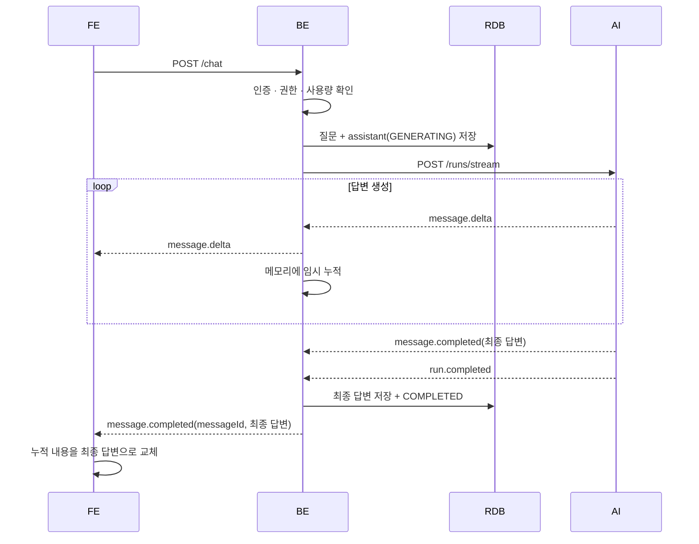

# ADR-004: 채팅 스트리밍은 BE 경유 SSE로 하고, 대화 원본은 BE에서 관리한다

## 1. Overview

- Date: 2026-07-22
- Status: Proposed
- Deciders: 근흐흐
- Tracking: features/FT-007-ai-튜터-채팅.md (Story 1·2·3)
- Implements: `contracts/backend-ai/sse/simple-agent-run-stream.yml` / FE↔BE 채팅 SSE 계약(신설 필요)
- Related: ADR-001, ADR-002, `geunhh/daily_thinking/26_07_16/chat-streaming-design-note.md`, `geunhh/daily_thinking/26_07_20/chat-streaming-alternatives-note.md`
- Supersedes / Superseded by: -

## 2. Context

FT-007은 사용자가 논문을 읽으면서 질문하고, 생성되는 답변을 실시간으로 확인한 뒤 같은 대화에서 후속 질문을 이어가는 기능이다. 사용자가 답변 생성을 기다리는 동안에도 내용을 볼 수 있어야 하므로 응답을 한 번에 반환하지 않고 생성되는 순서대로 전달해야 한다.

대화는 사용자가 생성하고 소유하며, 다시 보고 삭제할 수 있어야 하는 데이터다. 동시에 AI가 후속 답변을 만들 때 참고하는 입력이기도 하다. 질문과 답변을 계속 이어가려면 대화 원본을 관리할 위치와 다음 요청에서 이전 대화를 조회하는 방식을 정해야 한다.

답변은 AI가 생성하지만 사용자 인증, 논문 접근 권한과 대화 조회는 BE에서 처리한다. FE, BE, AI 사이에서 스트림을 어떤 경로로 전달하고, 누가 답변 완료를 확인해 저장할지 결정할 필요가 있다.

## 3. Decision

채팅 요청과 응답은 `FE → BE → AI` 경로로 전달한다. `FE ↔ BE`와 `BE ↔ AI` 모두 `POST 요청`에 대한 `SSE` 응답을 사용한다.

- FE는 BE에만 연결한다. AI 서버는 내부망에 둔다.
- BE는 인증, 논문 접근 권한, 사용량 제한 등을 확인한다.
- BE가 대화 세션과 메시지를 생성하고 RDB에 저장한다.
- AI는 답변 생성에 필요한 대화 내역을 참조하고 답변 내용을 생성한다. 제품 대화 원본의 저장과 변경은 BE가 담당한다.
- BE는 AI 응답을 FE에 전달하고, 정상 완료된 답변을 저장한다.

답변은 서버에서 클라이언트로 전달되는 **단방향 스트림이므로 SSE를 사용**한다. WebSocket은 현재 요구에 필요하지 않은 양방향 연결을 추가한다. Queue와 long-polling은 생성되는 답변을 바로 보여주는 방식에 맞지 않는다.

### delta와 완성본 처리

AI↔BE 계약의 성공 이벤트 순서는 다음과 같다.

```text
run.started
message.delta × N
message.completed
run.completed
```

- `message.delta`는 스트리밍 화면을 위한 임시 조각이다. 완전한 단어나 문장이라고 가정하지 않는다.
- BE는 delta를 FE에 바로 전달하고 메모리에도 임시로 누적한다. 토큰마다 DB에 저장하지 않는다.
- `message.completed.message`는 AI가 만든 최종 답변이다.
- BE는 누적한 문자열과 최종 답변이 다른 경우 로그를 남기고 최종 답변을 사용한다.
- `run.completed`까지 받은 뒤 최종 답변을 assistant message에 저장하고 상태를 `COMPLETED`로 바꾼다.
- 저장이 끝나면 BE는 FE에 `messageId`와 최종 답변을 보낸다. FE는 같은 메시지에 누적한 내용을 최종 답변으로 교체한다.
- 실패하거나 연결이 끊기면 assistant message를 `FAILED`로 바꾼다. 일부 delta만으로 답변을 확정하지 않는다.

메모리 누적값은 전송 중 확인을 위한 임시 값이다. DB와 FE에 남는 최종 내용은 `message.completed.message`다.

### 연결 종료와 재접속

- FE 연결이 끊기면 BE는 FE 전송만 중단한다. 진행 중인 AI 응답은 정해진 시간 안에서 계속 수신하고, 정상 완료되면 최종 답변을 저장한다.
- BE↔AI 연결이 끊기면 해당 실행은 실패로 처리한다. AI는 연결 종료를 감지하면 진행 중인 생성을 취소한다. 취소가 실제 LLM 호출까지 전달되는지는 통합 테스트로 확인한다.
- FE가 다시 연결하면 스트림을 이어받는 대신 저장된 메시지를 조회한다. 생성이 아직 끝나지 않았다면 `GENERATING` 상태를 표시한다.

### 중간 계층의 스트리밍 조건

SSE 경로의 중간 계층은 응답을 모아서 보내지 않고 받은 데이터를 바로 전달해야 한다. BE가 오류를 처리하고 종료 이벤트를 보낼 수 있도록 애플리케이션 timeout이 내부 연결과 로드밸런서 timeout보다 먼저 발생하게 구성한다. 구체적인 값과 컴포넌트별 설정은 설계 노트에서 관리한다.

### 대화 원본 관리

대화의 소유자는 사용자다. BE는 사용자 인증과 접근 권한을 기준으로 대화 원본의 조회, 저장과 삭제를 관리한다. AI는 답변 생성에 필요한 범위에서 대화 내역을 조회한다.

AI가 대화 내역을 얻는 방식은 이 ADR에서 정하지 않는다. 요청에 필요한 히스토리를 포함하거나, BE 내부 API를 호출하거나, BE가 제공하는 읽기 전용 view를 조회하는 방식을 구현 시 비교한다.

AI에는 대화 원본을 변경할 권한을 주지 않는다.

## 4. Options Considered

### Option A. BE 경유 SSE + BE 저장 — 채택



- 인증과 데이터 저장을 BE 한 곳에서 처리할 수 있다.
- AI 서버를 외부에 공개하지 않아도 된다.
- AI가 대화 저장소에 의존하지 않으므로 인스턴스를 늘리기 쉽다.
- BE가 살아 있는 동안 발생한 delta 누락이나 조립 차이는 최종 답변으로 정리할 수 있다.
- BE에 SSE 릴레이, 타임아웃, 버퍼링 해제 처리가 필요하다.
- 동시 연결이 현재 처리 방식의 한계를 넘으면 스트림 처리 방식을 다시 검토한다.

### Option B. FE가 AI에 직접 연결

BE가 접근 토큰을 발급하고 FE가 AI에 직접 연결하는 방식이다.

- BE의 릴레이 처리가 줄어든다.
- AI 서버에 인증, CORS, rate limit과 외부 엔드포인트 운영이 추가된다.
- BE가 완료와 실패를 직접 확인할 수 없다.
- 대화를 BE에 저장하려면 FE의 완료 보고, AI의 callback 또는 별도 저장 API가 필요하다.

현재 규모에서는 한 번의 내부 HTTP 연결을 줄이는 이점보다 추가되는 인증과 저장 처리가 더 크다고 판단했다.

### Option C. AI가 대화 전체를 저장

AI가 질문과 답변을 저장하고 BE는 세션 식별자만 관리하는 방식이다.

- AI가 히스토리와 LangGraph checkpoint를 한 곳에서 관리할 수 있다.
- BE가 중간에 종료돼도 AI가 계속 실행하고 저장할 수 있다.
- 세션 목록, 다시 보기, 삭제, 논문 접근 권한 같은 기능이 AI 저장소에 의존한다.
- BE에서 대화가 필요할 때마다 AI API를 호출하거나 AI 저장소 구조를 알아야 한다.

대화의 소유자는 사용자이며, 사용자 인증과 접근 권한은 BE가 관리한다. 따라서 BE를 제품 대화의 원본 저장소로 사용하고 AI는 답변 생성에 필요한 범위에서 대화를 조회한다.

### Option D. BE와 AI가 질문과 답변을 나누어 저장

BE가 사용자 질문을 저장하고 AI가 assistant 답변을 저장하는 방식이다.

- AI가 생성한 답변을 직접 저장할 수 있다.
- 질문과 답변은 같은 세션의 메시지 순서, 생성 상태, 재시도, 삭제와 사용량 규칙을 공유한다.
- 두 서비스가 상태를 나누어 변경하면 중복 요청과 실패를 처리하기 위한 멱등 callback이나 별도의 조정 처리가 필요하다.

현재 규모에서는 저장 책임을 나누어 얻는 이점보다 서비스 사이에 추가되는 조정이 더 크므로 채택하지 않는다.

## 5. Consequences

### Positive

- FE는 BE의 API와 인증 방식만 사용한다.
- 대화 조회와 변경을 BE의 로컬 트랜잭션으로 처리할 수 있다.
- AI는 대화 저장소 없이 요청 단위로 동작한다.
- 정상 완료 시 DB 내용과 FE 화면을 AI의 최종 답변으로 맞출 수 있다.
- FE 연결이 중간에 끊겨도 BE가 정상 완료한 답변은 저장되며, 사용자는 다시 연결한 뒤 이를 조회할 수 있다.

### Trade-offs

- BE가 AI SSE를 읽고 FE에 다시 전달해야 한다.
- SSE 경로의 버퍼링과 타임아웃을 BE와 인프라에서 설정해야 한다.
- BE 프로세스가 실행 중 종료되면 메모리에 누적한 delta와 AI 연결이 사라진다. AI가 같은 연결로 보낸 최종 답변도 받을 수 없다.
- 이 경우 질문과 `GENERATING` row는 남는다. 오래된 `GENERATING`을 `FAILED`로 바꾸는 처리가 필요하다.

### Follow-ups

- FE↔BE POST API와 SSE 이벤트 계약을 추가한다.
- FE 완료 이벤트에 `messageId`, 전체 답변, 완료 상태를 포함한다.
- AI `message.completed`와 `run.completed`를 FE 완료 이벤트로 바꾸는 기준을 계약에 적는다.
- FE는 delta를 append하고 완료 이벤트의 전체 답변으로 replace한다.
- FE 연결 종료 후에도 AI 응답 수신과 저장이 계속되는지 통합 테스트한다.
- BE↔AI 연결 종료가 실제 LLM 호출 취소까지 전달되는지 통합 테스트한다.
- 오래된 `GENERATING`을 `FAILED`로 바꾸는 처리를 추가한다.
- AI의 대화 내역 조회 방식을 정한다: 요청 payload, BE 내부 API 또는 읽기 전용 view.
- 선택한 조회 방식에 맞게 `thread_id` 또는 `session_id`의 의미와 권한 검증 방식을 계약에 명시한다.
- 중간 계층의 버퍼링과 timeout 값을 설계 노트와 인프라 설정에 반영한다.

## 6. Updates
