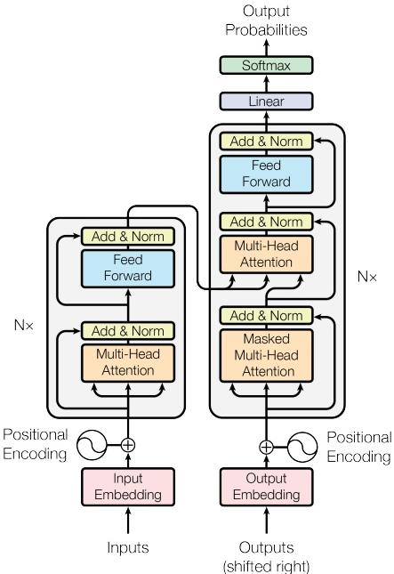

## Transformer Architecture

## Description

This diagram presents the complete encoder-decoder flow of the Transformer. On the left, input symbols pass through an input embedding and are combined with positional encoding. The encoder then processes them through a stack of $N=6$ identical layers. Each encoder layer contains a multi-head self-attention sub-layer followed by a position-wise feed-forward sub-layer. The “Add & Norm” blocks and looping arrows show that every sub-layer is surrounded by a residual connection and followed by layer normalization.

On the right, output symbols shifted one position to the right pass through an output embedding and positional encoding before entering the decoder. Each of the decoder’s $N=6$ layers contains masked multi-head self-attention, multi-head attention over the encoder output, and a position-wise feed-forward network. The mask and shifted outputs ensure that the prediction at a position depends only on earlier output positions. After the decoder stack, a linear transformation and softmax produce the output probabilities. The paper sets the shared output dimension of the embedding and sub-layers to $d_{model}=512$, which permits the residual additions shown throughout the diagram.

<!-- cited-in
- [3 Model Architecture](../source/03-model-architecture/overview.md)
-->
