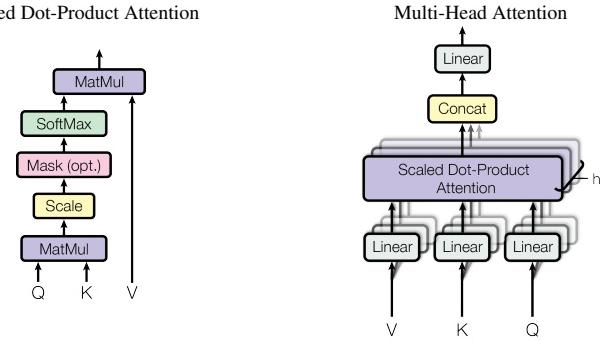

## Scaled and Multi-Head Attention

## Description

The left half traces scaled dot-product attention from its three inputs to its output. Queries $Q$ and keys $K$ are multiplied to produce compatibility scores. Those scores are divided by $\sqrt{d_k}$, may receive an optional mask, and pass through softmax to become weights. A second matrix multiplication applies the weights to the values $V$, producing $Attention(Q,K,V)=softmax(QK^T/\sqrt{d_k})V$. The paper introduces the scaling factor to counteract large dot products that can push softmax into regions with extremely small gradients. In decoder self-attention, the optional mask blocks connections to subsequent positions so the model remains auto-regressive.

The right half shows how multi-head attention repeats that operation in parallel. Learned linear projections create different versions of $Q$, $K$, and $V$ for each head; every head performs scaled dot-product attention, the resulting head outputs are concatenated, and a final linear projection produces the multi-head output. The paper uses $h=8$ heads with $d_k=d_v=64$. It states that the parallel heads let the model attend jointly to information from different representation subspaces at different positions, while keeping total computational cost similar to full-dimensional single-head attention.

<!-- cited-in
- [3.2 Attention](../source/03-model-architecture/03-02-attention/overview.md)
-->
