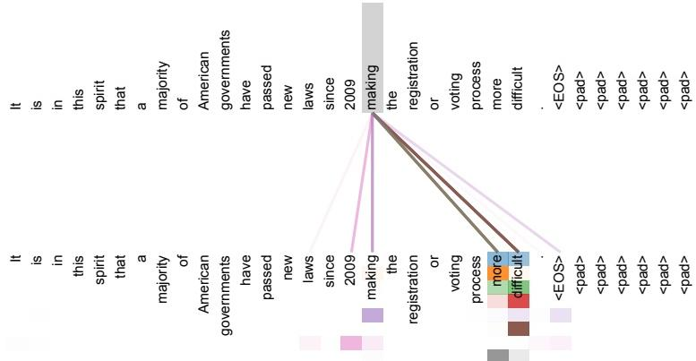

## Long-Range Attention from “making”

## Description

This visualization isolates encoder self-attention from the word “making” in layer 5 of the six-layer encoder. Two copies of the same sentence are arranged across the figure, and the gray column marks “making” as the position whose attention is being examined. Colored lines connect that position to words attended to by different heads; the colors distinguish the heads rather than separate sentences.

The sentence places several words between “making” and the later phrase “more difficult”: “making the registration or voting process more difficult.” The strongest visible connections reach “more” and “difficult,” completing the long-range dependency identified by the paper’s caption. By showing only attention from “making,” the figure makes a specific point: multiple encoder attention heads can directly connect one word with relevant words at distant positions in the same sequence.

<!-- cited-in
- [Attention Visualizations](../source/attention-visualizations.md)
-->
