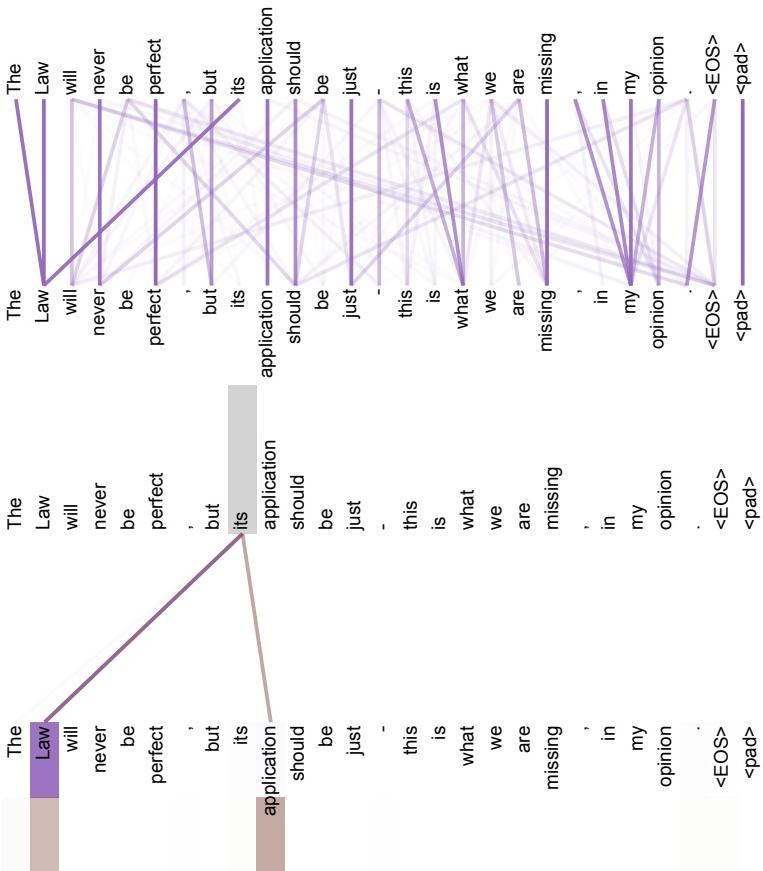

## Anaphora Attention from “its”

## Description

This two-part visualization examines encoder self-attention in layer 5 of 6 for the sentence “The Law will never be perfect, but its application should be just - this is what we are missing, in my opinion.” The upper panel shows the full pattern of connections produced by attention head 5 across the sentence.

The lower panel narrows the view to attention from the word “its” for heads 5 and 6. The gray column identifies “its,” while the two colored connections point sharply toward “Law” and “application.” The authors describe these heads as apparently involved in anaphora resolution and emphasize how sharp their attention is for this word. The figure therefore records focused, head-specific links between “its,” the earlier word “Law,” and the adjacent word “application,” without assigning the same role to every connection in the full upper panel.

<!-- cited-in
- [Attention Visualizations](../source/attention-visualizations.md)
-->
