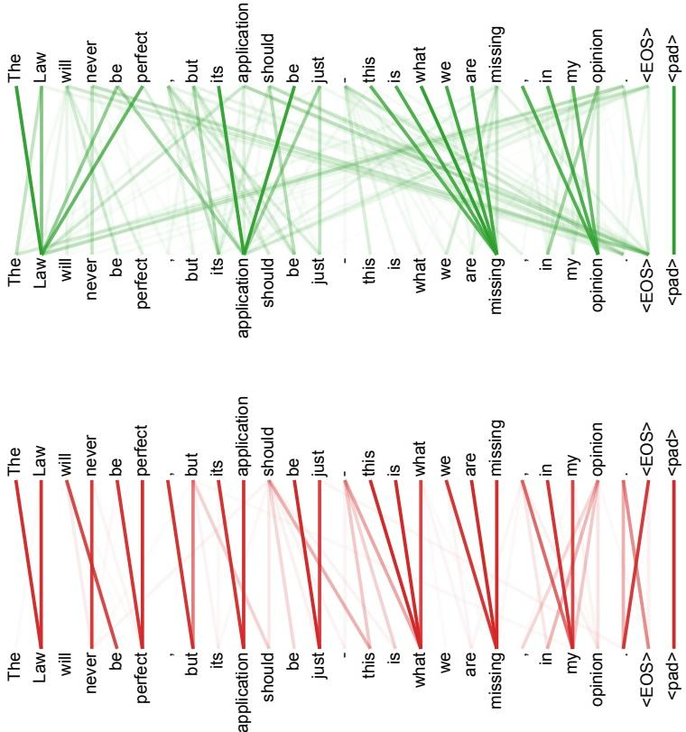

## Sentence-Structure Attention Heads

## Description

This figure compares two different encoder self-attention heads from layer 5 of 6 on the same sentence used in the preceding visualization: “The Law will never be perfect, but its application should be just - this is what we are missing, in my opinion.” Each panel places two copies of the sentence opposite one another and draws the attention connections between their token positions. The upper head is shown in green and the lower head in red.

The two panels produce visibly different connection patterns over identical words: the paths and the positions where connections concentrate are not the same in the green and red examples. The paper does not assign a named grammatical function to either individual head; it states more cautiously that many heads exhibit behavior that seems related to sentence structure. The comparison supports the authors’ observation that different heads learned to perform different tasks.

<!-- cited-in
- [Attention Visualizations](../source/attention-visualizations.md)
-->
